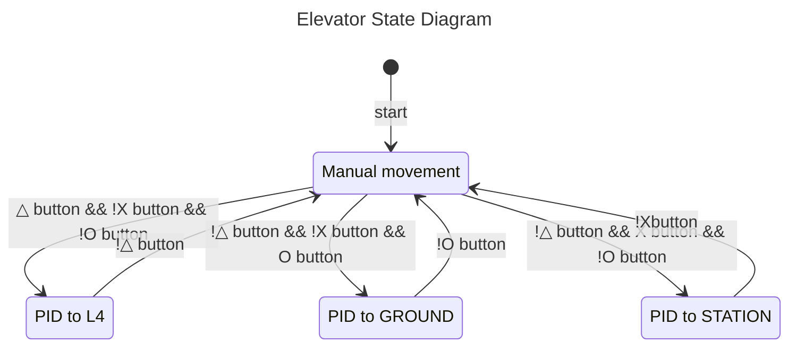

# Elevator FSM Spec

```mermaid
---
title: Elevator State Diagram
---
stateDiagram-v2
state "Manual movement" as MANUAL
state "PID to L4" as L4
state "PID to GROUND" as GROUND
state "PID to STATION" as STATION
[*] --> MANUAL: start

MANUAL --> L4: △ button && !X button && !O button
MANUAL --> GROUND: !△ button && !X button && O button
MANUAL --> STATION: !△ button && X button && !O button
L4 --> MANUAL: !△ button
STATION --> MANUAL: !Xbutton
GROUND --> MANUAL:  !O button
```