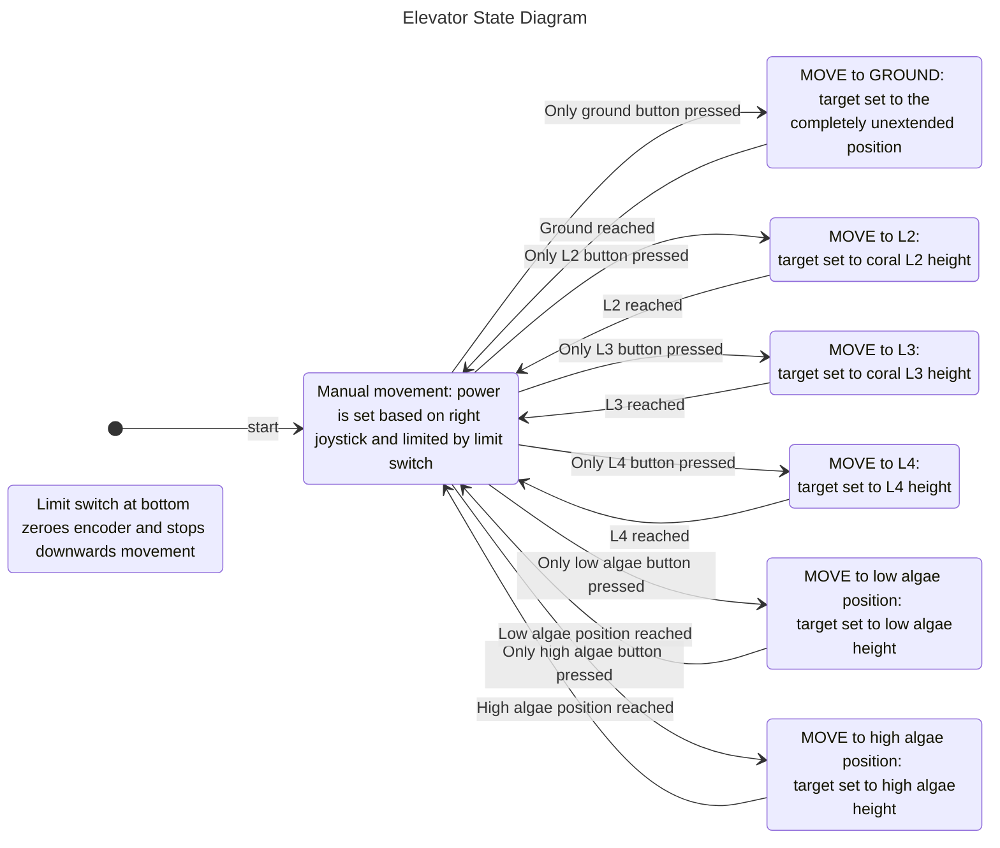

# Elevator FSM Spec

```mermaid
---
title: Elevator State Diagram
---
stateDiagram-v2

direction LR

state "Manual movement: power is set based on right joystick and limited by limit switch" as MANUAL
state "MOVE to L4: <p> target set to L4 height" as L4
state "MOVE to GROUND: <p> target set to the completely unextended position" as GROUND
state "MOVE to L2: <p> target set to coral L2 height" as L2
state "MOVE to L3: <p> target set to coral L3 height" as L3
state "MOVE to low algae position: <p> target set to low algae height" as LOW_ALGAE
state "MOVE to high algae position: <p> target set to high algae height" as HIGH_ALGAE

[*] --> MANUAL: start

MANUAL --> GROUND: Only ground button pressed
MANUAL --> L2: Only L2 button pressed
MANUAL --> L3: Only L3 button pressed
MANUAL --> L4: Only L4 button pressed
MANUAL --> LOW_ALGAE: Only low algae button pressed
MANUAL --> HIGH_ALGAE: Only high algae button pressed

L2 --> MANUAL: L2 reached
L3 --> MANUAL: L3 reached
L4 --> MANUAL: L4 reached
GROUND --> MANUAL: Ground reached
LOW_ALGAE --> MANUAL: Low algae position reached
HIGH_ALGAE --> MANUAL: High algae position reached

note: Limit switch at bottom zeroes encoder and stops downwards movement

```