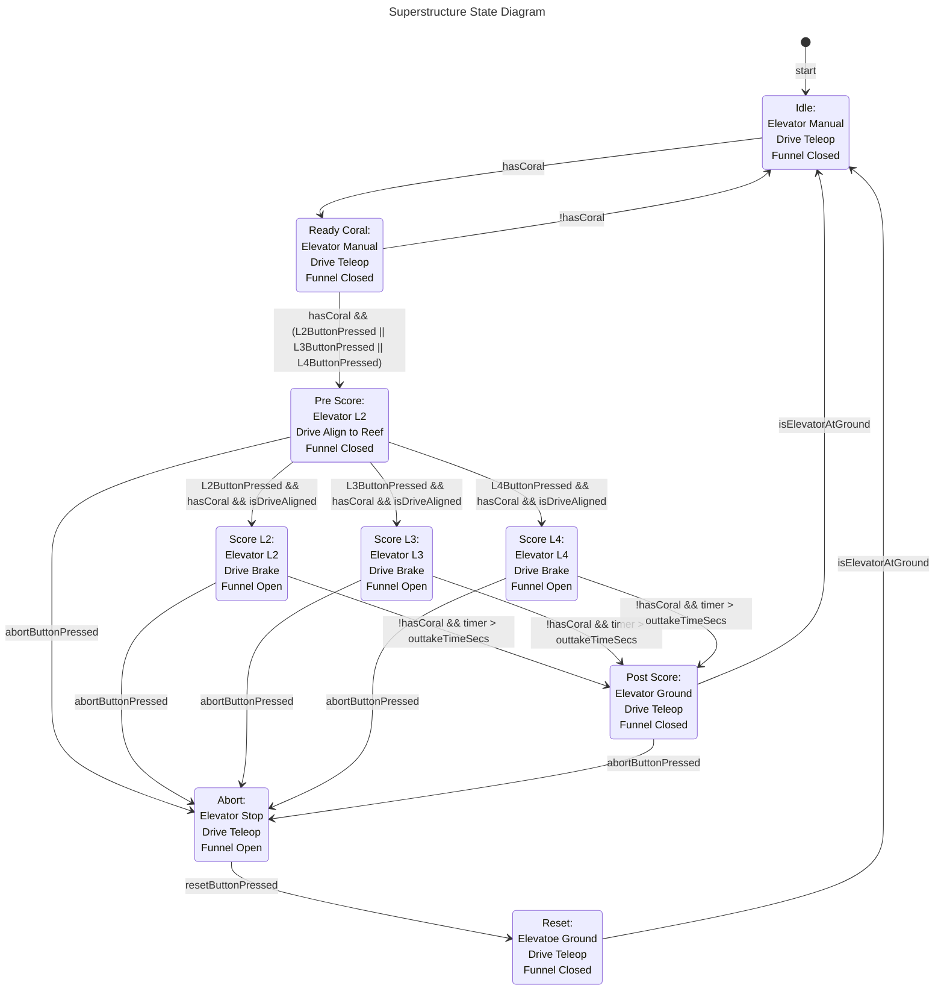

# Superstructure FSM Spec

```mermaid
---
title: Superstructure State Diagram
---

stateDiagram-v2
state "Idle: <p> Elevator Manual <p> Drive Teleop <p> Funnel Closed" as IDLE
state "Ready Coral: <p> Elevator Manual <p> Drive Teleop <p> Funnel Closed" as CORAL_READY
state "Abort: <p> Elevator Stop <p> Drive Teleop <p> Funnel Open" as ABORT
state "Reset: <p> Elevatoe Ground <p> Drive Teleop <p> Funnel Closed" as RESET

state "Pre Score: <p> Elevator L2 <p> Drive Align to Reef <p> Funnel Closed" as PRE_SCORE

state "Score L2: <p> Elevator L2 <p> Drive Brake <p> Funnel Open" as SCORE_L2
state "Score L3: <p> Elevator L3 <p> Drive Brake <p> Funnel Open" as SCORE_L3
state "Score L4: <p> Elevator L4 <p> Drive Brake <p> Funnel Open" as SCORE_L4

state "Post Score: <p> Elevator Ground <p> Drive Teleop <p> Funnel Closed" as POST_SCORE


[*] --> IDLE: start 

%% From Idle
IDLE --> CORAL_READY : hasCoral

%% From Ready Coral
CORAL_READY --> IDLE: !hasCoral
CORAL_READY --> PRE_SCORE: hasCoral && (L2ButtonPressed || L3ButtonPressed || L4ButtonPressed)

%% From Abort
ABORT --> RESET: resetButtonPressed

%% From Reset
RESET --> IDLE: isElevatorAtGround

%% From Pre Score
PRE_SCORE --> SCORE_L2: L2ButtonPressed && hasCoral && isDriveAligned
PRE_SCORE --> SCORE_L3: L3ButtonPressed && hasCoral && isDriveAligned
PRE_SCORE --> SCORE_L4: L4ButtonPressed && hasCoral && isDriveAligned
PRE_SCORE --> ABORT: abortButtonPressed

%% From Score L2
SCORE_L2 --> POST_SCORE: !hasCoral && timer > outtakeTimeSecs
SCORE_L2 --> ABORT: abortButtonPressed

%% From Score L3
SCORE_L3 --> POST_SCORE: !hasCoral && timer > outtakeTimeSecs
SCORE_L3 --> ABORT: abortButtonPressed

%% From Score L4
SCORE_L4 --> POST_SCORE: !hasCoral && timer > outtakeTimeSecs
SCORE_L4 --> ABORT: abortButtonPressed

%% From Post Score
POST_SCORE --> IDLE: isElevatorAtGround
POST_SCORE --> ABORT: abortButtonPressed
```