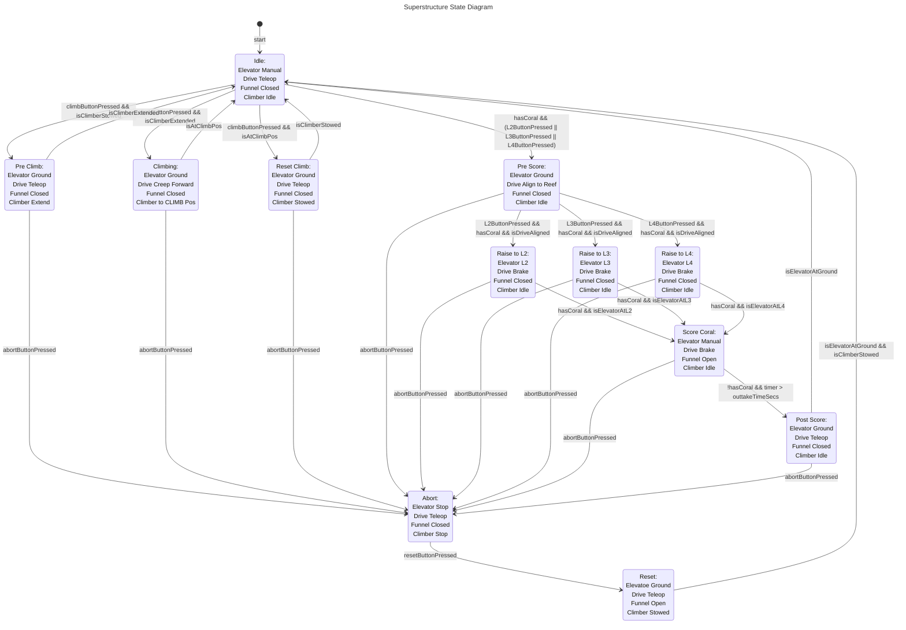

# Superstructure FSM Spec

```mermaid
---
title: Superstructure State Diagram
---

stateDiagram-v2
state "Idle: <p> Elevator Manual <p> Drive Teleop <p> Funnel Closed <p> Climber Idle" as IDLE
state "Abort: <p> Elevator Stop <p> Drive Teleop <p> Funnel Closed <p> Climber Stop" as ABORT
state "Reset: <p> Elevatoe Ground <p> Drive Teleop <p> Funnel Open <p> Climber Stowed" as RESET

state "Pre Score: <p> Elevator Ground <p> Drive Align to Reef <p> Funnel Closed <p> Climber Idle" as PRE_SCORE

state "Raise to L2: <p> Elevator L2 <p> Drive Brake <p> Funnel Closed <p> Climber Idle" as RAISE_L2
state "Raise to L3: <p> Elevator L3 <p> Drive Brake <p> Funnel Closed <p> Climber Idle" as RAISE_L3
state "Raise to L4: <p> Elevator L4 <p> Drive Brake <p> Funnel Closed <p> Climber Idle" as RAISE_L4

state "Score Coral: <p> Elevator Manual <p> Drive Brake <p> Funnel Open <p> Climber Idle" as SCORE

state "Post Score: <p> Elevator Ground <p> Drive Teleop <p> Funnel Closed <p> Climber Idle" as POST_SCORE

state "Pre Climb: <p> Elevator Ground <p> Drive Teleop <p> Funnel Closed <p> Climber Extend" as PRE_CLIMB
state "Climbing: <p> Elevator Ground <p> Drive Creep Forward <p> Funnel Closed <p> Climber to CLIMB Pos " as CLIMBING
state "Reset Climb: <p> Elevator Ground <p> Drive Teleop <p> Funnel Closed <p> Climber Stowed" as RESET_CLIMB

[*] --> IDLE: start 

%% From Idle
IDLE --> PRE_CLIMB : climbButtonPressed && isClimberStowed
IDLE --> CLIMBING : climbButtonPressed && isClimberExtended
IDLE --> RESET_CLIMB : climbButtonPressed && isAtClimbPos
IDLE --> PRE_SCORE: hasCoral && (L2ButtonPressed || L3ButtonPressed || L4ButtonPressed)

%% From Abort
ABORT --> RESET: resetButtonPressed

%% From Reset
RESET --> IDLE: isElevatorAtGround && isClimberStowed

%% From Pre Climb
PRE_CLIMB --> IDLE : isClimberExtended
PRE_CLIMB --> ABORT: abortButtonPressed

%% From Climbing
CLIMBING --> IDLE : isAtClimbPos
CLIMBING --> ABORT: abortButtonPressed

%% From  Reset Climb
RESET_CLIMB --> IDLE : isClimberStowed
RESET_CLIMB --> ABORT: abortButtonPressed


%% From Pre Score
PRE_SCORE --> RAISE_L2: L2ButtonPressed && hasCoral && isDriveAligned
PRE_SCORE --> RAISE_L3: L3ButtonPressed && hasCoral && isDriveAligned
PRE_SCORE --> RAISE_L4: L4ButtonPressed && hasCoral && isDriveAligned
PRE_SCORE --> ABORT: abortButtonPressed

%% From Raise L2
RAISE_L2 --> SCORE: hasCoral && isElevatorAtL2
RAISE_L2 --> ABORT: abortButtonPressed

%% From Raise L3
RAISE_L3 --> SCORE: hasCoral  && isElevatorAtL3
RAISE_L3 --> ABORT: abortButtonPressed

%% From Raise L4
RAISE_L4 --> SCORE: hasCoral  && isElevatorAtL4
RAISE_L4 --> ABORT: abortButtonPressed

%% From Score
SCORE --> POST_SCORE: !hasCoral && timer > outtakeTimeSecs
SCORE --> ABORT: abortButtonPressed

%% From Post Score
POST_SCORE --> IDLE: isElevatorAtGround
POST_SCORE --> ABORT: abortButtonPressed
```
