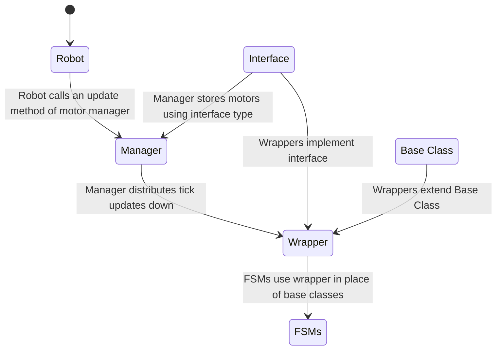

# Simulation Documentation
## Motor Sim
### Purpose

Motors do not update encoder values in sim, classes such as TalonFXSimState don't do any of the physics required for this

In order to make our motors function properly both in sim and on the robot, we have motor wrappers in order to simulate motor physics during sim

Motor wrappers extend the base motor class and do not affect behavior outside of sim so they are non-intrusive, only requiring the constructor to be changed. This means that Mech can just code FSMs "like normal" without having to worry about what Sim is doing

### How to use

Simply switch out the base constructor for the regular motor class with our motor wrapper class, and use as normal

Example:
```java
// without motor sim: 
elevatorMotor = new TalonFX(HardwareMap.CAN_ID_ELEVATOR);

// using motor sim:
elevatorMotor = new TalonFXWrapper(HardwareMap.CAN_ID_ELEVATOR);
```

### Technical documentation

#### Startup guide for writing wrappers

as a summary: motor wrappers are solutions for simulating motors at a per-motor level, and are non-generalized so that our FSMs don't have to be.

All motor classes have some built in motor sim. All of these are partial implementations. As is shown by online resources, motor wrappers are not the intended solution to simulate behavior, instead the commonly used method is instead to just use them as seperate "hardware" devices. This however is very unweildy.

The motor wrapper consists of constructors, an update method that uses a physics simulation to update motor values, and other logging. The logging is not neccesarily required for simulation functionality, but can be useful.

#### Example Snippets of Code

for example SparkMax has a pretty well implemented motor sim that does physics for us as long as we provide the setpoint:
```java
public SparkMaxWrapper(int deviceId, MotorType type, DCMotor dcMotor) {
		// Initialize motor
		super(deviceId, type);
		init();

		// Create sim instance
		motorType = dcMotor;
		motorSim = new SparkMaxSim(this, motorType);
	}

	@Override
	public void update() {
		// Update sim instance
		motorSim.iterate(targetVelocity, RobotController.getBatteryVoltage(), LOOP_PERIOD_MS);
	}

	@Override
	public void set(double speed) {
		// Set real motor speed
		super.set(speed);

		// Add speed to buffer for sim
		this.targetVelocity = speed * motorType.freeSpeedRadPerSec;
	}
```
However, since TalonFX is a lot more complicated, it needs a more generalized solution that accomodates the ControlRequest structure used to control the motors. Instead of going by velocity, we update an external motor physics simulation class with the intended voltage to set to the motor and then set the output of the motor accordingly
```java
@Override
public void update() {
    if (Robot.isSimulation()) {
        var talonFXSim = getSimState();

        // set the supply voltage of the TalonFX
        talonFXSim.setSupplyVoltage(RobotController.getBatteryVoltage());

        // get the motor voltage of the TalonFX
        var motorVoltage = talonFXSim.getMotorVoltageMeasure();

        // use the motor voltage to calculate new position and velocity
        // using WPILib's DCMotorSim class for physics simulation
        motorSimModel.setInputVoltage(motorVoltage.in(Volts));
        motorSimModel.update(LOOP_PERIOD_MS); // assume 20 ms loop time

        // apply the new rotor position and velocity to the TalonFX;
        // note that this is rotor position/velocity (before gear ratio), but
        // DCMotorSim returns mechanism position/velocity (after gear ratio)
        talonFXSim.setRawRotorPosition(motorSimModel.getAngularPosition().times(K_GEAR_RATIO));
        talonFXSim.setRotorVelocity(motorSimModel.getAngularVelocity().times(K_GEAR_RATIO));
    }
}
```
#### class hierarchy
In order to make a proper workaround, the physics sims need to be updated every tick (iteration of the main robot loop during sim). To not have main interact with hardware (or in this case sim) classes, it is the responsibility of the motors to add themselves to a list of updated motors. This is called the MotorManager and it is updated every tick. Additionally, since the motor manager could need to update different types of motors, all the motor wrappers implement an interface that allows them to be updated by the motor manager, called LoggedMotor, with common methods that the motor manager expects. Below is a mermaid diagram to show the class hierarchy and intended uses. It will require that you have Mermaid in order to display properly

