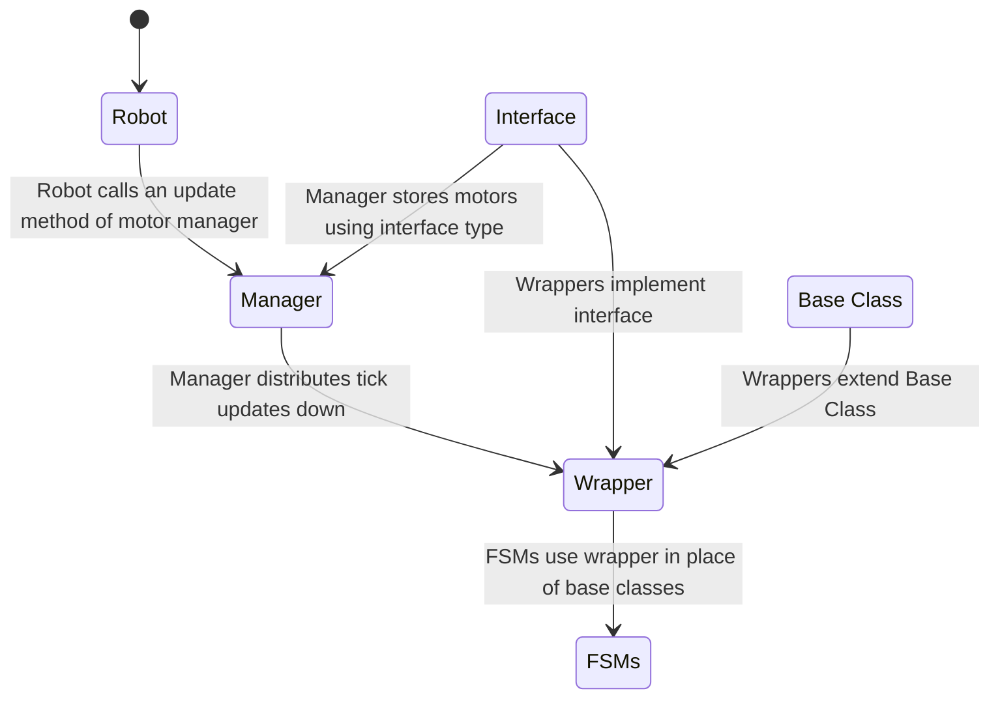

# Simulation Documentation
## Motor Sim
### Purpose

Motors do not update encoder values in sim, classes such as TalonFXSimState don't do any of the physics required for this

In order to make our motors function properly both in sim and on the robot, we have motor wrappers in order to simulate motor physics during sim

Motor wrappers extend the base motor class and do not affect behavior outside of sim so they are non-intrusive, only requiring the constructor to be changed. This means that Mech can just code FSMs "like normal" without having to worry about what Sim is doing

### How to use

Simply switch out the base constructor for the regular motor class with our motor wrapper class, and use as normal

Example:
```java
// without motor sim: 
elevatorMotor = new TalonFX(HardwareMap.CAN_ID_ELEVATOR);

// using motor sim:
elevatorMotor = new TalonFXWrapper(HardwareMap.CAN_ID_ELEVATOR);
```

### Technical documentation

#### Startup guide for writing wrappers

as a summary: motor wrappers are solutions for simulating motors at a per-motor level, and are non-generalized so that our FSMs don't have to be.

All motor classes have some built in motor sim. All of these are partial implementations. As is shown by online resources, motor wrappers are not the intended solution to simulate behavior, instead the commonly used method is instead to just use them as seperate "hardware" devices. This however is very unweildy.

The motor wrapper consists of constructors, an update method that uses a physics simulation to update motor values, and other logging. The logging is not neccesarily required for simulation functionality, but can be useful.

#### Example Snippets of Code

for example SparkMax has a pretty well implemented motor sim that does physics for us as long as we provide the setpoint:
```java
public SparkMaxWrapper(int deviceId, MotorType type, DCMotor dcMotor) {
		// Initialize motor
		super(deviceId, type);
		init();

		// Create sim instance
		motorType = dcMotor;
		motorSim = new SparkMaxSim(this, motorType);
	}

	@Override
	public void update() {
		// Update sim instance
		motorSim.iterate(targetVelocity, RobotController.getBatteryVoltage(), LOOP_PERIOD_MS);
	}

	@Override
	public void set(double speed) {
		// Set real motor speed
		super.set(speed);

		// Add speed to buffer for sim
		this.targetVelocity = speed * motorType.freeSpeedRadPerSec;
	}
```
However, since TalonFX is a lot more complicated, it needs a more generalized solution that accomodates the ControlRequest structure used to control the motors. Instead of going by velocity, we update an external motor physics simulation class with the intended voltage to set to the motor and then set the output of the motor accordingly
```java
@Override
public void update() {
    if (Robot.isSimulation()) {
        var talonFXSim = getSimState();

        // set the supply voltage of the TalonFX
        talonFXSim.setSupplyVoltage(RobotController.getBatteryVoltage());

        // get the motor voltage of the TalonFX
        var motorVoltage = talonFXSim.getMotorVoltageMeasure();

        // use the motor voltage to calculate new position and velocity
        // using WPILib's DCMotorSim class for physics simulation
        motorSimModel.setInputVoltage(motorVoltage.in(Volts));
        motorSimModel.update(LOOP_PERIOD_MS); // assume 20 ms loop time

        // apply the new rotor position and velocity to the TalonFX;
        // note that this is rotor position/velocity (before gear ratio), but
        // DCMotorSim returns mechanism position/velocity (after gear ratio)
        talonFXSim.setRawRotorPosition(motorSimModel.getAngularPosition().times(K_GEAR_RATIO));
        talonFXSim.setRotorVelocity(motorSimModel.getAngularVelocity().times(K_GEAR_RATIO));
    }
}
```
#### class hierarchy
In order to make a proper workaround, the physics sims need to be updated every tick (iteration of the main robot loop during sim). To not have main interact with hardware (or in this case sim) classes, it is the responsibility of the motors to add themselves to a list of updated motors. This is called the MotorManager and it is updated every tick. Additionally, since the motor manager could need to update different types of motors, all the motor wrappers implement an interface that allows them to be updated by the motor manager, called LoggedMotor, with common methods that the motor manager expects. Below is a mermaid diagram to show the class hierarchy and intended uses. It will require that you have Mermaid in order to display properly



## How to import custom CAD into Advantage Kit 

<i> Note: If you would like a full breakdown, complete instructions are located <a href="https://docs.advantagescope.org/more-features/custom-assets/"> here</a> </i>

### Steps 

<ol> 
	<li> <b> Download CAD Assistant <a href="https://www.opencascade.com/products/cad-assistant/"> here</a>. </b> </li> <br>
	<li>  <b> Get Your Onshape Model into CAD Assistant </b> </li>  
	We must convert the Onshape model into a .glb format for Advantage Scope. Below is how you can do it: <br> <br>
	<li> <b> Export the Onshape Model as a .STEP File </b> </li> 
	In Onshape: 
	<ol> 
		<li> Right-click or double-click the model name at the bottom of the screen. </li>
		<li> Select Export. </li>
		<li> Choose the .STEP file format. </li> 
	</ol> <br>
	<li> <b> Open CAD Assistant </b> </li> 
	After downloading CAD Assistant, follow these steps: 
	<ol> 
		<li> Open CAD Assistant. </li>
		<li> Navigate to your Downloads folder. </li>
		<li> Find and open the .STEP file** you just downloaded. </li>
		<li> Depending on your model, it might take a minute to load. </li> 
	</ol> <br>
	<li> <b> Save the Model in .glb Format → .glb </b> </li>
		Once the model is loaded: 
	<ol> 
		<li> Click the floppy disk icon to save the model as a new file. This is the second item on the left.</li>
		<li> Select the STEP format and then choose .glb. </li>
		<li> Click the Settings button next to the file format selection.</li>
		<li> Enable the option to Merge faces within the same part <b> (This is CRUCIAL!). </b> </li>
	</ol>
	<li> <b> Rename the Model File  </b> </li>
	<b> IMPORTANT: It is CRUCIAL to rename the file to model (all lowercase). </b>
	<ul>
		<li> If the file is not named “model,” Advantage Scope will not detect it correctly! </li>
		<li> Once renamed, click Save. (save all files as “model”!)</li>
		<li> Robot models can contain articulated components for visualizing mechanism data. The base glTF model should include no components, then each component should be exported as a separate glTF model. Components models follow the naming convention "model_INDEX.glb", so the first articulated component would be "model_0.glb"</li>
	</ul>
	<li> <b> Create a JSON File Using the Python Script (cadutil.py) </b> </li>
	Download or access the cadutil.py Python script. <br> 
	To generate the necessary .json configuration file:
	<ol>
		<li> Run the Python <a href="https://docs.google.com/document/d/10USemRleA6LUeJVjW4Y1HlmHW0156KO7vS_Pl_alAFc/edit?tab=t.0"> script</a> or use the online <a href="https://www.programiz.com/online-compiler/4K0EEiR0U1Tbe">compiler</a> and copy the output json </li>
		<li> Input the following information:</li>
		<ul> 
			<li> Name of the model: What you want the model to be called in Advantage Scope. </li>
			<li> Width of the model (in meters).</li>
			<li> Length of the model (in meters). </li>
		</ul>
		<li> After running the script you will get text that you need to now paste into a file you will name config.json <b> (YOU MUST NAME IT THIS) </b> </li>
	</ol>
	<li> <b> Prepare the Advantage Scope Simulation </b> </li>
	Now that the files are ready, you need to place them in the correct folder for Advantage Scope:
	<ol> 
		<li> Open Advantage Scope.</li>
		<li> In the top left, click Help, then select Show Assets Folders.</li>
		<li> In the Assets Folder, create a new folder with the same name you inputted in the Python script.</li>
		<li> Add both the config.json and model.glb files to this folder.</li>
	</ol>
	<li> <b> Run the Simulation </b> </li>
	Simulate Robot Code
	<ul>
		<li>In the top-right corner of your development environment, locate the WPILib logo. </li>
		<li> Click on the logo and type Simulate Robot Code in the search bar.</li>
		<li> Press Enter and wait for a prompt to appear at the top of the screen.</li>
		<li> When prompted, select Use Sim GUI and click OK.</li>
	</ul>
	Open the Java Simulation (Window with blue background)
	<ul>
		<li> Once the Java Simulation opens, ensure a controller is plugged into your system.</li>
		<li> Navigate to the System Joysticks tab and locate a controller labeled on Index 0.</li>
		<li> Drag the controller label into the Joysticks tab.</li>
	</ul>
	Launch Advantage Scope
	<ul> 
		<li>Return to the WPILib interface, click the logo, and type Start Tool in the search bar. </li>
		<li> Press Enter, then type AdvantageScope and press Enter again.</li>
		<li> Once Advantage Scope opens, click File in the window's top-left corner and select Connect to Simulator. </li>
	</ul>
	Set Up the Pose
	<ul>
		<li> In Advantage Scope, locate the drop-down menu labeled Pose on the left-hand side.</li>
		<li> Expand the menu to find two entries: .type and robotPose.</li>
		<li> Drag robotPose into the Poses section in the middle of the window.</li>
	</ul>
	View the Simulation
	<ul>
		<li> You should now see Kit Bot displayed.</li>
		<li> Click the arrow icon to expand the details on the left side of the name.</li>
		<li> If all the previous steps were completed correctly, your custom model should appear in the simulation.</li>
	</ul>
	Once the files are correctly placed in the folder, you can run the simulation in Advantage Scope. If all steps were followed correctly, the model should now be available for use! 
</ol>
<br>

### Final Notes: 

<ul>
	<li> Ensure the model file is named "model" to be detected by Advantage Scope. </li>
	<ul>
		<li> Ensure that any mech components are labeled as per their respective index. </li>
	</ul>
	<li> If you encounter any issues with file formats or exporting, revisit the export and save steps in CAD Assistant. </li>
</ul>
	


